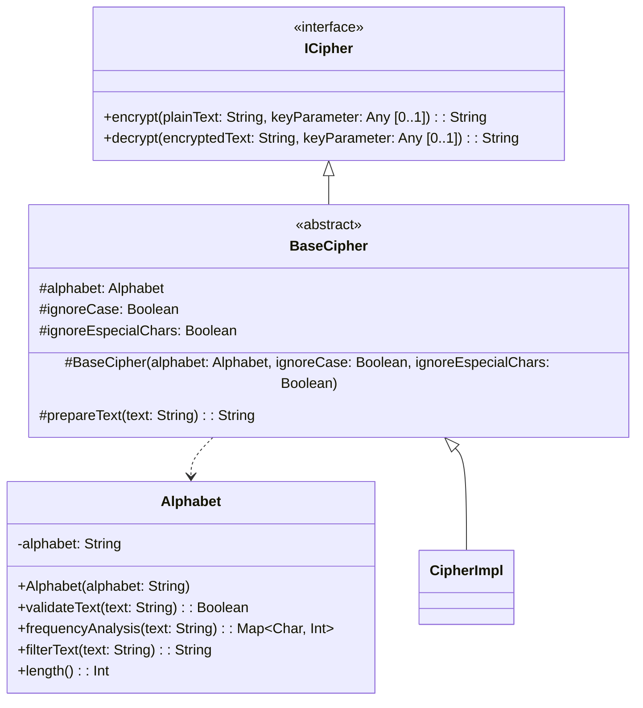

# ClassicCrypto

Este proyecto implementa una biblioteca de cifrados clásicos en Kotlin, organizada y documentada para facilitar su uso y extensión.

## Entorno de desarrollo

1. **Requisitos previos:**
   - [JDK 17+](https://adoptium.net/)
   - [Gradle](https://gradle.org/) (opcional, el wrapper está incluido)
   - IDE recomendado: [IntelliJ IDEA](https://www.jetbrains.com/idea/)

2. **Clonar el repositorio:**
   ```sh
   git clone <URL_DEL_REPOSITORIO>
   cd ClassicCrypto
   ```

3. **Importar el proyecto en el IDE:**
   - Abrir la carpeta raíz en IntelliJ IDEA.
   - Esperar a que Gradle sincronice las dependencias.

## Compilación del proyecto

Puedes compilar el proyecto usando el wrapper de Gradle incluido:

```sh
./gradlew build
```

En Windows:
```sh
gradlew.bat build
```

Los artefactos compilados se ubican en `lib/build/libs/lib.jar`.

## Uso de la biblioteca

Para utilizar la biblioteca en tu proyecto Kotlin/Java:

1. Agrega el archivo JAR generado como dependencia en tu proyecto.
2. Importa los cifrados desde el paquete `classiccrypto.ciphers` y sus subpaquetes.

Ejemplo de uso:
```kotlin
import classiccrypto.ciphers.cesar.CesarCipher
import classiccrypto.abstractions.Alphabet

val alfabeto = Alphabet("ABCDEFGHIJKLMNÑOPQRSTUVWXYZ")
val cifrador = CesarCipher(alfabeto, CesarKeyParameters(3))
val textoCifrado = cifrador.encrypt("MENSAJE")
val textoDescifrado = cifrador.decrypt(textoCifrado)
```

## Interfaces y abstracciones comunes

La biblioteca está estructurada en torno a interfaces y clases base para facilitar la extensión y el uso:

- **ICipher**: Interfaz principal para cifrados, define los métodos `encrypt` y `decrypt`.
- **BaseCipher**: Clase abstracta que implementa lógica común y facilita la creación de nuevos cifrados.
- **Alphabet**: Representa el alfabeto utilizado por los cifrados.
- **KeyParameters**: Clases específicas para los parámetros de clave de cada cifrado.

Cada cifrado se encuentra en su propio subpaquete bajo `classiccrypto.ciphers`, siguiendo buenas prácticas de organización.


## Cifrado clásicos incluidos
- César
- Vigenère
- Columnar Transposition
- Simple Substitution
- Atbash
- Playfair
- Rail Fence
- Permutation
- Hill
- AutoKey
- XOR

## Pruebas

Las pruebas unitarias se encuentran en `lib/src/test/kotlin/classiccrypto/ciphers/` y pueden ejecutarse con:

```sh
./gradlew test
```

---

Para más información, consulta la documentación en los archivos fuente y los comentarios de cada clase.

